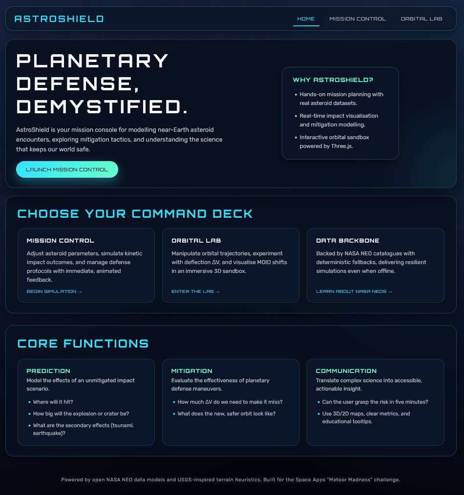
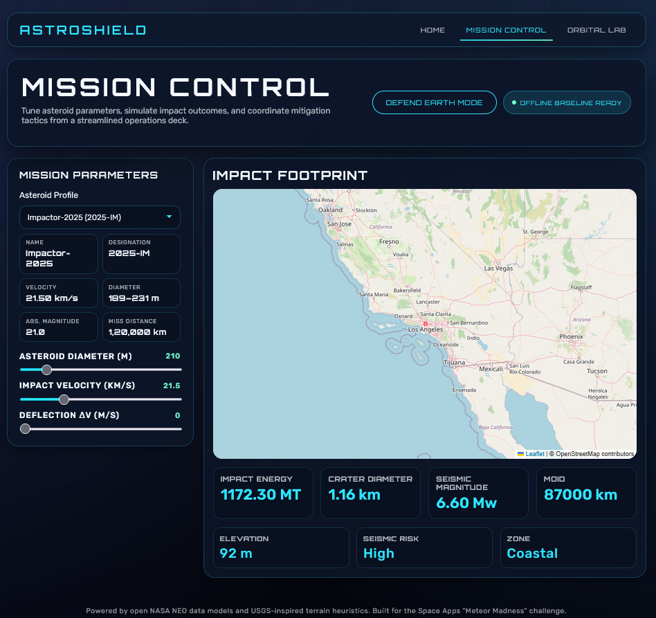
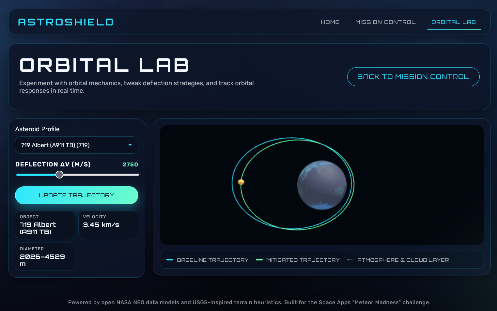

	<h1>AstroShield Planetary Defense Simulator</h1>

AstroShield is a planetary defense dashboard that ingests live asteroid telemetry from NASA, blends it with environmental context from USGS feeds, and exposes the results through an interactive mission control interface. The platform delivers three core capabilities: it forecasts impact consequences, simulates mitigation maneuvers, and communicates the science in a way that policy teams and learners can understand at a glance.

The backend is written in Python using Flask, Flask-Cors, requests, and SciPy. It normalises the NASA NEO payload, computes kinetic energy, crater scaling, seismic magnitude, and orbital deflection metrics, then provides deterministic mock data whenever APIs rate-limit. The frontend runs in JavaScript with Leaflet, D3, GSAP, and Three.js, combining geospatial heatmaps, animated crater visualisations, and a fully navigable orbital lab. Together these layers keep the experience resilient and scientifically grounded.

	

	

	

### Features

AstroShield offers a live mission control view that shows asteroid specifics, impact location, crater size, seismic magnitude, and readiness alerts. Defense Mode lets analysts tune delta-v inputs, watch mitigation outcomes, and track whether the asteroid still intersects Earth. The Orbital Lab provides a 3D playground for orbital trajectories, including pre- and post-deflection paths.

Operational tooling now includes a `/health` status endpoint summarising NASA/USGS connectivity and mock readiness, surfaced on the mission console, plus a scenario briefing export (powered by `python-pptx`) that produces a ready-to-share PowerPoint deck from any simulation payload.

### Data and Integrations

NASA’s Near Earth Object Web Service supplies asteroid telemetry, while the NASA JPL Small-Body Database enriches orbital metadata. USGS elevation and geoserve endpoints provide ground and seismic context. OpenStreetMap tiles power the impact basemap. Libraries include Leaflet, D3, GSAP, Three.js with OrbitControls, and python-pptx for presentations.

### Creative Direction

AstroShield’s interface mirrors a mission control console with cinematic yet purposeful visuals. The goal was to combine rigorous physics with explainable storytelling: all graphics respond to deterministic calculations, mock fallbacks keep the view alive during outages, and UI copy treats users as collaborators, not spectators.

### Getting Started

1. Create a virtual environment and install dependencies using the requirements file in `astroshield/requirements.txt`.
2. Define NASA API credentials in `.env` or rely on the default `DEMO_KEY` for quick demos.
3. Launch the Flask app via `python app.py` from the `astroshield` directory.
4. Open the dashboard at `http://localhost:5000`—use the navigation to launch the Mission Control console or jump straight into the Orbital Lab.

### Repository Guide

`astroshield/backend` contains the data orchestration layer, NASA/USGS clients, and the physics engine. `astroshield/static/js` holds the Mission Control, Defense Mode, and Orbital Lab scripts. `docs` includes presentation assets plus the automated data-flow slide generator located at `docs/generate_dataflow_slide.py`.

### Contributing

Contributions should maintain the balance between accuracy and performance. Please open an issue describing proposed changes, run any relevant linting or smoke checks, and accompany new features with relevant documentation updates.

### License

AstroShield is released under the Apache License. See `LICENSE` for details.
